# AI-Powered Post-Offer Engagement Platform

Helps recruiters engage candidates in the gap between offer acceptance and
joining: tracks the engagement journey, detects joining risk from what
candidates actually say, recommends next actions, and automates follow-ups.

**[▶ Watch the demo walkthrough](https://drive.google.com/drive/folders/1lbQKIuN7wv-p9re2g9E-uU2dNpgXlEyA)**

The guiding sentence for every design decision:

> A recruiter opens this every morning and immediately knows **which candidates
> need attention and why**.

---

## Quick start

```bash
docker compose up -d --build
docker compose exec -T api python -m app.db.seed
```

| Surface | URL |
|---|---|
| Recruiter app | http://localhost:3000 |
| API docs (OpenAPI) | http://localhost:8000/docs |
| Readiness probe | http://localhost:8000/api/v1/health/ready |

Sign in with any seeded recruiter, password `demo1234`.
`aditya.menon@example.com` is the admin.

```bash
docker compose run --rm api pytest -q   # 166 tests
make psql                               # database shell
make reset                              # wipe, migrate, reseed
```

---

## The platform

**[▶ Demo video](https://drive.google.com/drive/folders/1lbQKIuN7wv-p9re2g9E-uU2dNpgXlEyA)** — a walkthrough of everything below.

### Dashboard — "who needs attention today?"

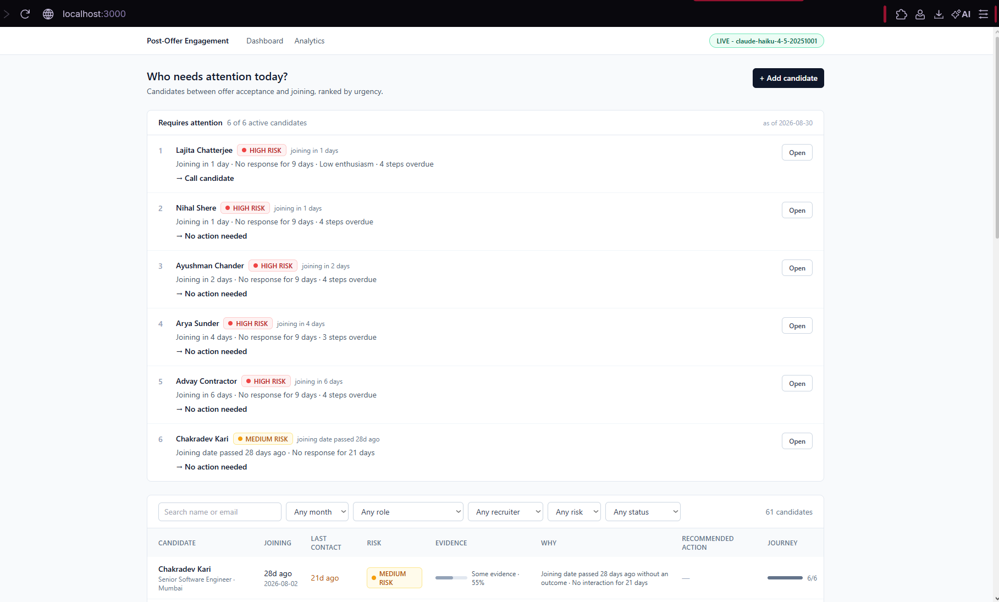

The ranked queue leads, then the filterable table. Every queue entry carries
the risk band, the reasons behind it, and a recommended action — so a recruiter
can decide whether to act without opening anything. The ranking is a pure
function, not an LLM call: a queue that reshuffles between refreshes is one
recruiters stop trusting.

### Candidate list, with the brief's five filters

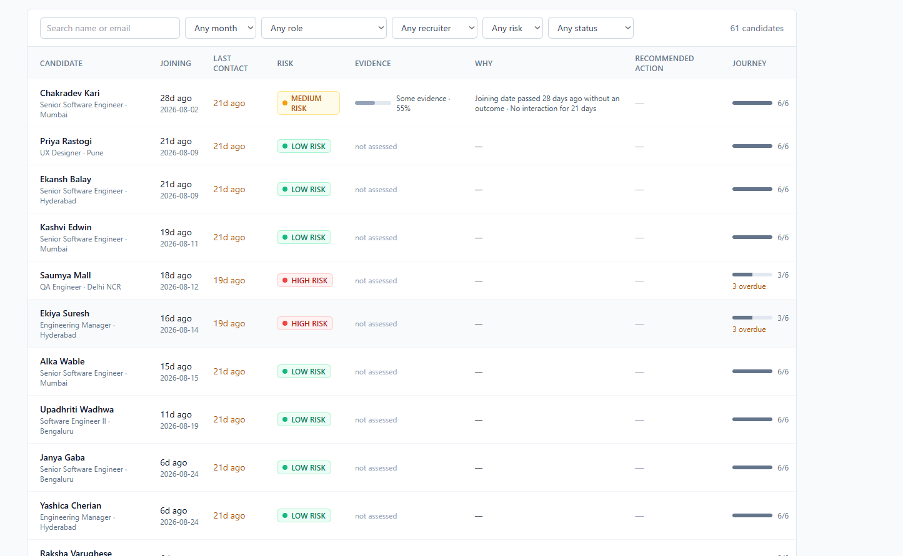

Joining month, role, recruiter, risk and status. Risk and evidence strength are
separate columns because they answer different questions. `not assessed` is
shown rather than a zero, since "nothing has looked at this yet" and "looked,
found nothing" are different facts.

### Adding a candidate

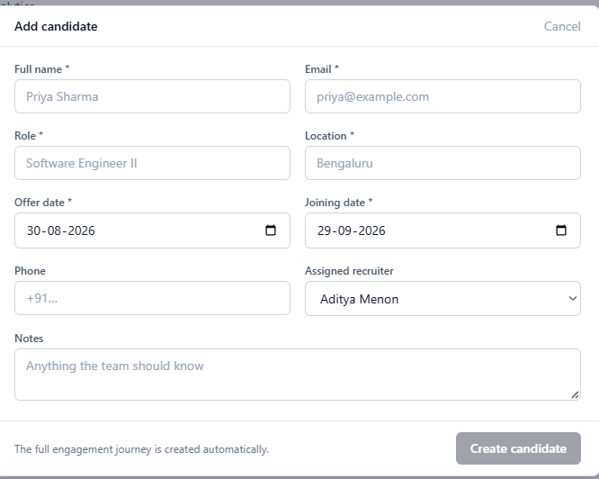

The full six-stage engagement journey is created server-side on save, with each
stage's due date frozen from its SLA — so a new candidate is immediately
visible in the funnel and eligible for the automation rules.

### Candidate detail — the explainability panel

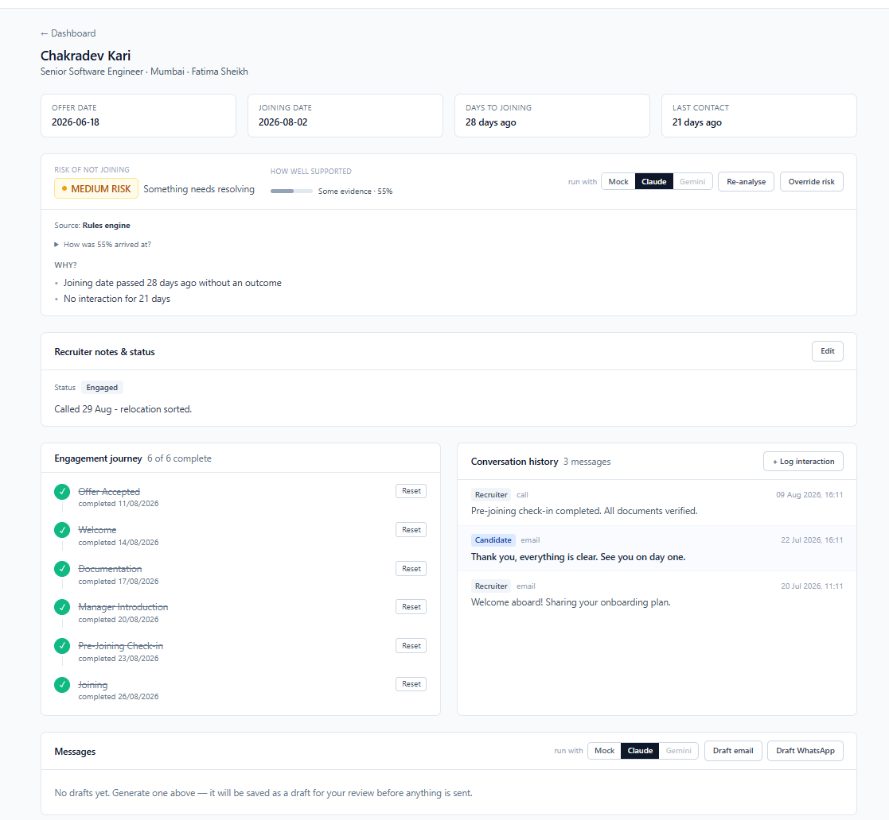

Risk is never a bare label. **Risk of not joining** and **how well supported**
are separate readings; `How was 55% arrived at?` expands into the term-by-term
derivation. Below that: recruiter notes kept deliberately apart from AI output,
the journey with completed and pending steps, conversation history, and the
message composer where drafts wait for human approval.

The provider toggle (`Mock · Claude · Gemini`) switches backends per call.
Gemini is greyed out here because no key is configured — shown disabled rather
than hidden, so it is clear the option exists and why it cannot be used.

### Analytics

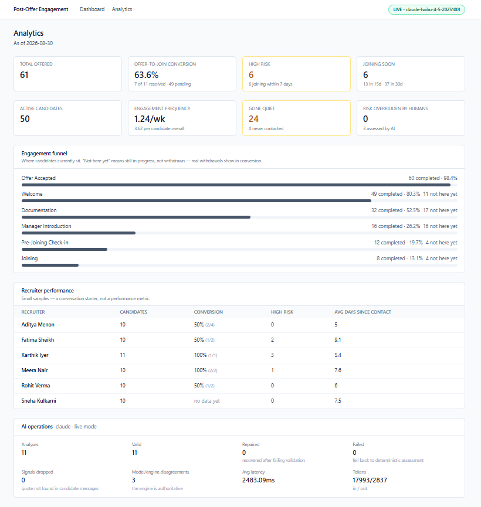

Every metric the brief names. Two deliberate choices visible here: conversion
counts only *resolved* candidates (49 still pending are excluded, since someone
joining next month is not a failure yet), and the funnel says **"not here yet"**
rather than "dropped off" — those candidates are mid-journey, not withdrawn.

The AI operations panel is read straight from the analyses table: schema
validity, repairs, fallbacks, signals dropped by the grounding guardrail,
model/engine disagreements, latency and token spend. No separate monitoring
stack.

---

## How it works

```
  RECRUITER
      |
      v
  +------------------------------------------------------------------+
  |  NEXT.JS  ·  localhost:3000                                       |
  |  Attention queue -> Candidate detail -> Analytics                 |
  +------------------------------------------------------------------+
      |  REST  /api/v1
      v
  +------------------------------------------------------------------+
  |  FASTAPI  ·  localhost:8000                                       |
  |                                                                   |
  |   MODULES        candidates · engagement · analytics              |
  |                  automation · attention · ai · auth · audit       |
  |                            |                                      |
  |   DOMAIN         risk engine · confidence · queue ranking         |
  |   (pure, no I/O) rule predicates          <- fully unit-tested    |
  |                            |                                      |
  |   AI PIPELINE    snapshot -> hash -> cache -> generate            |
  |                  -> validate -> repair -> fallback -> guardrails  |
  |                            |                                      |
  |   SCHEDULER      hourly sweep -> idempotent follow-ups            |
  +------------------------------------------------------------------+
      |                                    |
      v                                    v
  +-------------------+     +--------------------------------------+
  |  POSTGRESQL 16    |     |  LLM PROVIDER  (swappable per call)  |
  |  12 tables        |     |  Claude · Gemini · deterministic mock|
  +-------------------+     +--------------------------------------+
```

**The one-paragraph version.** A recruiter opens the dashboard and sees a
ranked queue of who needs attention. Each candidate carries a risk band, the
reasons behind it, and a recommended action. The risk band is computed by a
deterministic engine from countable facts — days to joining, days of silence,
overdue steps — *blended with* typed signals an LLM extracted from what the
candidate actually wrote, each backed by a verbatim quote. The model never
picks the band; it only reads language. A recruiter can override any judgement,
with a reason, and that override is never overwritten. Meanwhile an hourly job
flags candidates who are joining soon and have gone quiet, drafts them a
message, and raises a follow-up task — once, no matter how often it runs.

### The five ideas worth understanding

| Idea | Why it exists |
|---|---|
| **Hybrid risk** | Rules are auditable but cannot read *"still figuring out relocation"*. Models read language but cannot be audited. Each does what it is good at. |
| **Confidence ≠ risk** | How likely someone is to drop out, and how much evidence backs that call, are different questions. HIGH risk at 45% confidence is a real and useful state. |
| **Grounded signals** | Every concern cites a verbatim quote. If the quote is not in the candidate's own messages, the signal is dropped. This is what stops confident-sounding fiction. |
| **Human always wins** | Overrides are recorded with actor, reason and certainty, and no later analysis overwrites them. |
| **Degrade, never break** | Model outage → deterministic fallback. No API key → labelled Demo Mode. The dashboard never 500s because an LLM had a bad day. |

---

## Demo Mode

**The application runs with no API key.** With no provider key set, a
deterministic mock provider serves every analysis and message. Every screen
populates, the automation fires, the analytics compute, and the test suite runs
— all without a single LLM call or a rupee of spend.

The mock is not a stub. It reads the same candidate snapshot the real prompt
carries, matches the candidate's own words against a keyword lexicon, and
returns signals with **genuine verbatim quotes** pulled from those messages.
The brief's relocation example is detected here exactly as Gemini detects it.

Setting `ANTHROPIC_API_KEY` (or `GEMINI_API_KEY`) switches to Live Mode with
no other change. Three providers are available and selectable per call from
the UI: `claude`, `gemini`, `mock`.

**It is labelled everywhere**, deliberately:

| Surface | Demo Mode | Live Mode |
|---|---|---|
| UI header badge | `DEMO MODE — deterministic mock, no LLM calls` | `LIVE — claude-haiku-4-5` |
| `GET /api/v1/ai/status` | `"provider": "mock"` | `"provider": "claude"` |
| `GET /api/v1/health/ready` | `"mode": "demo"` | `"mode": "live"` |
| Every stored analysis | `provider = mock` | `provider = claude` |

If a mock returned flawless, perfectly stable output with no indication of what
it was, a reviewer would be right to wonder whether the "AI" is hardcoded.
Saying so plainly turns that suspicion into evidence of deliberate design.

Its honest limitation: keyword matching cannot handle negation ("no relocation
issues at all"), sarcasm, or paraphrase. That is what Live Mode is for.

---

## 1. Architecture and database schema

> Diagrams below are Mermaid. If they show a spinner rather than a picture,
> that is GitHub's renderer, not the source — the plain-text architecture
> diagram under **How it works** above says the same thing and always
> renders.

Three services on one compose network. Deliberately a modular monolith, not
microservices — at this size the coordination cost buys nothing.

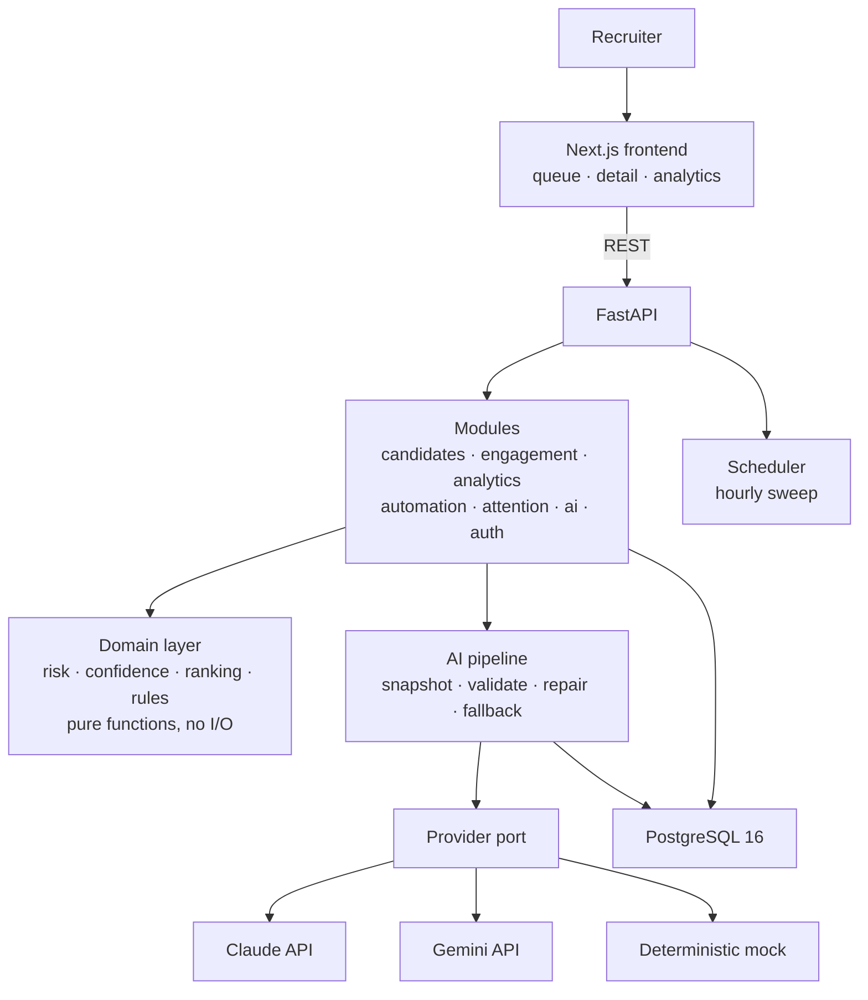

**Layering.** Routers do HTTP only. Services own transactions and orchestration.
Repositories own SQL. `domain/` is pure functions with zero I/O — which is what
makes the highest-consequence logic (risk, ranking, rules) exhaustively testable
in milliseconds without a database.

### Schema

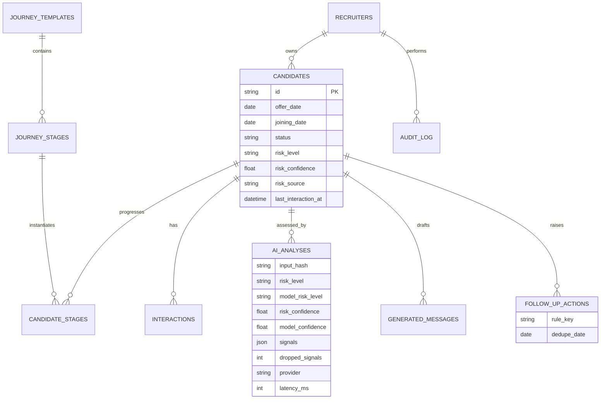

The columns worth knowing:

| Column | Why it exists |
|---|---|
| `candidates.risk_source` | `rule`, `ai` or `human`. A human override is never overwritten. |
| `candidates.risk_confidence` | Evidence strength, derived — separate from the band. |
| `ai_analyses.input_hash` | SHA-256 of the canonical snapshot. The cache key, and how freshness works without a TTL. |
| `ai_analyses.risk_level` | The authoritative blended band the product shows. |
| `ai_analyses.model_risk_level` | What the model *proposed*. Kept so disagreement stays measurable. |
| `ai_analyses.dropped_signals` | Signals whose quote was not in the candidate's messages. The hallucination counter. |
| `follow_up_actions.dedupe_date` | The idempotency key. One action per candidate, per rule, per window. |

Full dump: [`docs/schema.sql`](docs/schema.sql). Access guide:
[`docs/database.md`](docs/database.md).

**Three schema decisions worth explaining:**

**Journey progress is rows, not a `current_stage` column.** Stage drop-off
analytics and "which steps are pending" both need per-stage timestamps. A single
column cannot express either. A `candidate_stages` row exists for every stage
from creation, so *pending* is real data rather than an absence.

**Terminal states exist so conversion is computable.** The brief asks for
offer-to-join conversion but never mentions recording an outcome. Without
`joined` / `dropped_out` the metric has no denominator.

**Enums are VARCHAR validated by Pydantic, not native PG enums.** Adding a value
to a native enum needs a migration and a table lock; here it is a code change.
It also keeps the SQLite fallback usable when Docker is unavailable.

---

## 2. AI flow and how structured output is validated

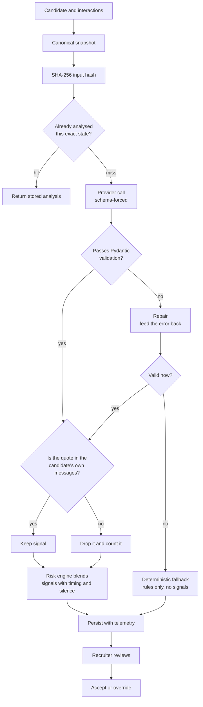

### The response contract

```
AIAnalysis
├── summary                str
├── risk_level             enum  LOW | MEDIUM | HIGH
├── risk_confidence        float 0..1
├── signals[]
│    ├── type              enum  relocation_concern | competing_offer |
│    │                           compensation_concern | notice_period_issue |
│    │                           low_enthusiasm | positive_intent
│    └── evidence          str   verbatim quote
├── risk_rationale         str
├── next_action            enum  CALL_CANDIDATE | SEND_RELOCATION_SUPPORT |
│                                SEND_REMINDER | MANAGER_INTRODUCTION |
│                                SCHEDULE_CONVERSATION | ESCALATE | NO_ACTION
└── recommended_follow_up  str
```

**Validation is four layers, not one:**

1. **Schema-forced generation.** Gemini takes `response_schema`; Claude takes
   the schema as a forced tool's `input_schema`. Different mechanisms, same
   property: the model is constrained at decode time rather than asked politely
   for JSON.
2. **Pydantic validation.** The boundary between "the model said something" and
   "the system believes it".
3. **One repair attempt.** The invalid output *and* the exact validator error
   are fed back. Most invalid generations are one field away from correct, so
   this recovers them for the price of one call. A blind retry without the
   error mostly reproduces the same mistake.
4. **Deterministic fallback.** After two failures the answer is still a working
   dashboard — a rules-only assessment, marked `status=failed`, carrying **no
   signals** (without the model there is no semantic extraction, and inventing
   signals would be precisely the dishonesty the guardrails exist to prevent).

**The pipeline never raises for provider failure.** A recruiter opening a page
during a Gemini outage sees a degraded assessment labelled as such, not a 502.

### Guardrails

**Closed enums are the load-bearing injection defence.** Candidate-authored text
flows into the prompt. A free-text action field would let injected content
propose something the application cannot render or perform. With closed enums
the worst an injection achieves is picking a *different valid* action — which a
recruiter then reviews.

**Grounding.** Schema validation proves output is well-formed, not that it is
*true to the input*. A model can emit a perfectly valid `competing_offer`
quoting a sentence the candidate never wrote — a hallucination that passes every
type check, and the one that would destroy trust fastest (a recruiter opens the
transcript, cannot find the quote, and stops believing any of it). Every quote
is checked against the candidate's own messages; ungrounded signals are dropped
and counted in `dropped_signals`. **Recruiter messages do not count** — a model
quoting us back at ourselves is not evidence about the candidate.

**Human approval gate.** Generated messages are drafts until a recruiter
approves them. This is the real defence: injected text cannot approve itself.

**Prompt hygiene.** Untrusted content is delimiter-wrapped and explicitly
labelled data-never-instructions. Prompts are versioned files
(`app/ai/prompts/analysis_v1.md`) with `prompt_version` stamped on every stored
row, so a regression is attributable.

### Why there is no RAG

Per-candidate context is a handful of interactions — roughly 1–3k tokens. It
fits in the prompt whole. Adding embeddings, a vector store and a retrieval step
would introduce infrastructure, latency and a *new failure mode* (bad recall) to
solve a problem that does not exist.

RAG earns its place the moment messages must be grounded in a corpus:
relocation policy documents, compensation FAQs, a library of high-converting
message templates. That is the documented extension point.

---

## 3. Risk classification — and its limitations

### Hybrid, not pure-LLM

A model asked to output "HIGH" cannot be audited, drifts between versions, and
gives a recruiter nothing to disagree with. Pure rules cannot read *"I am still
figuring out relocation and accommodation"* and understand it as a concern.

So the two are split by what each is actually good at:

- **Rules own everything countable** — days to joining, days of silence, overdue
  stages, unanswered messages.
- **The LLM owns only semantic extraction** — turning free text into typed
  signals with supporting quotes. **It never picks the band.**

The band is computed by `domain/risk.py` from both. Categories are capped
(timing 2.0, silence 2.5, journey 3.0, signals 4.0) so no single dimension
dominates — without caps, six overdue documents would outscore a candidate who
explicitly said they are considering another offer.

One term is not additive: **silence × imminence**. Five days of quiet is
unremarkable a month out and alarming four days before someone starts. That
interaction carries the heaviest weight in the model, and it is exactly the
condition the brief singles out for automation.

The model's own proposed band is stored in `model_risk_level` purely so
disagreement stays measurable. On the seeded population the model and engine
**disagree on 28 of 96 analyses** — a number that is queryable rather than
invisible.

### Confidence is separate, derived, and not a probability

Risk asks *how likely is this candidate not to join*. Confidence asks *how much
should you trust that answer*. A candidate can legitimately be HIGH risk at 55%
confidence — one worrying sentence and nothing else to go on.

**The model is asked for confidence, and it is stored — but not used.**
Self-reported LLM confidence is poorly calibrated: it tracks fluency more than
evidence, and there is nothing to check it against. The displayed number is
computed from observable properties:

- volume of evidence (two messages support less than twelve)
- whether the candidate ever replied (intent is unknowable from someone who
  never wrote to us)
- recency (a concern from five weeks ago may be resolved)
- whether signals carry verbatim quotes (checkable vs. asserted)
- agreement between the rule layer and the signal-informed verdict

Both numbers are kept, so the gap between what the model claims and what the
evidence supports is a real calibration signal.

The UI labels it **"heuristic"**. It is an uncalibrated *ordinal*: 0.8 means
"better supported than 0.6", not "correct 80% of the time". `1.0` is reserved
exclusively for human overrides.

### Limitations — stated plainly

- **No ground truth.** Thresholds and weights are hand-tuned against realistic
  scenarios, not learned. There are no historical joined/dropped outcomes to
  calibrate against. Everything here is a considered prior, not a fitted model.
- **Confidence cannot become a probability** until those outcomes exist.
- **English-only.** Signal extraction assumes English; politeness conventions
  and sarcasm skew it. A candidate being formally polite may read as low
  enthusiasm.
- **Silence is genuinely ambiguous.** Busy ≠ disengaged. The system treats
  prolonged silence as risk because that is the actionable reading, not because
  it is certain.
- **Correlation, not causation.** A relocation concern correlates with dropout;
  it does not cause it, and "fixing" the signal is not the same as fixing the
  problem.
- **Recruiter-level rates are statistically noisy.** With one to four resolved
  candidates each, a single dropout swings a percentage by tens of points. The
  UI says so.
- **Keyword matching in Demo Mode** cannot handle negation or paraphrase.

### Human override

Any recruiter can override any band. The override requires a **reason** — an
unexplained override is indistinguishable from a mis-click three weeks later,
and the disagreements between recruiter and model are exactly what is worth
reviewing. The UI shows source, actor, timestamp and reason, with a revert path.
Every override writes a before/after audit row.

**A human override is never overwritten** by a subsequent analysis. That is the
entire purpose of `risk_source`; silently reverting a recruiter's decision would
make the override feature a lie.

---

## 4. The automated engagement workflow

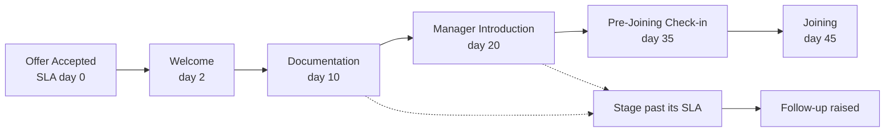

Four rules, each a pure predicate over a `CandidateContext`:

| Rule | Fires when | Window |
|---|---|---|
| `joining_soon_no_contact` | **The brief's example** — joins ≤7d **and** no interaction ≤5d | 1 day |
| `stage_overdue` | An engagement step is past its SLA | 3 days |
| `high_risk_unattended` | HIGH risk with no urgent follow-up open | 1 day |
| `relocation_support` | Relocation concern detected | 7 days |

**Idempotency is the property that matters.** The scheduler runs hourly, a
recruiter can trigger it manually during a demo, and a restart can leave partial
work. Two layered mechanisms:

1. A **deterministic dedupe bucket** derived from each rule's window, stored on
   the row and covered by `uq_follow_up_idempotency (candidate_id, rule_key,
   dedupe_date)`. The guarantee lives in the database, not in application logic
   a race could slip past.
2. A **savepoint per insert**, so a constraint violation rolls back one row
   rather than the whole sweep.

Verified: running the sweep twice creates **0** duplicates and reports 39
deduplicated. Without this, an hourly job would bury the attention queue within
a day — the fastest way to make recruiters stop reading it.

**The named flaw.** APScheduler runs in-process, so every API replica would fire
the same job. A Postgres advisory lock means exactly one replica wins each tick.
That is a *mitigation, not a distributed scheduler* — the production shape is an
external trigger (Cloud Scheduler, k8s CronJob, Celery beat) dispatching to
workers that do not share a process with the request path. `run_all_rules` is a
plain function, so that move is a scheduling change, not a rewrite.

Message drafting is best-effort: if generation fails the follow-up is still
created, because the task is what actually gets the candidate contacted.

---

### The engagement journey

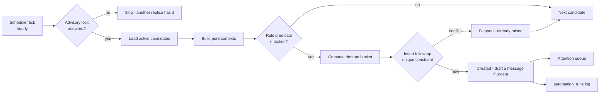

SLAs are days from the **offer date**, frozen onto each `candidate_stages` row
at creation so a later template change cannot silently move historical
deadlines. A stage past its SLA is what turns a passive checklist into
something that raises an alert.

---

## 5. Trade-offs, and what would change for production

| Decision | Chosen | Rejected | Why | Revisit when |
|---|---|---|---|---|
| Risk model | Hybrid rules + LLM signals | Pure LLM; pure rules | Explainable, auditable, reproducible; still catches semantic concerns | Real outcome labels exist |
| Confidence | Derived heuristic | LLM self-reported | Self-reported confidence is miscalibrated and unfalsifiable | Labels enable true calibration |
| Retrieval | None | RAG + vector DB | Context fits in-prompt; RAG adds a failure mode for zero gain | Grounding in a policy corpus is needed |
| Jobs | In-process APScheduler + advisory lock | Celery/Redis | One fewer service; idempotency covers reruns | Multi-replica, or jobs outgrow a tick |
| Rate limiting | In-process sliding window | Redis / gateway | Purpose is budget protection, not DDoS defence | >1 replica, or abuse becomes real |
| Enums | App-layer strings | Native PG enums | Cheap migrations; keeps SQLite fallback | Schema stabilises |
| AI freshness | Hash-keyed cache | Recompute per request | Dashboards would burn tokens on every render | Sub-second freshness required |
| Model tier | Flash-class | Pro-class | Structured extraction, not hard reasoning; cost and latency dominate | Eval accuracy proves insufficient |
| Frontend data | Client-side fetch | RSC server fetch | One origin; avoids the container-vs-browser URL trap | SEO or first-paint matters |
| Pagination | Offset | Keyset | Dashboard needs jump-to-page and a total count | Deep offsets degrade |
| Primary keys | String UUIDv4 | Auto-increment int | Non-enumerable, shard-safe | Index locality bites → UUIDv7/ULID |
| Services | Modular monolith | Microservices | Coordination cost buys nothing at this size | Independent scaling needed |

**What I would improve before calling this production-ready**

1. **Enforce auth on every route.** Reads are currently open so the demo works
   without a login wall; RBAC is enforced only on `/audit`. This is a deliberate
   demo decision, not an oversight — but it is the first thing to close.
2. **Move AI calls behind a queue.** Synchronous analysis ties request latency
   to provider latency.
3. **Redis-backed rate limiting**, so the limit is not per-process.
4. **Retention policy on `raw_response`**, which stores candidate text for
   debugging. It should expire.
5. **CI pipeline** running pytest and the eval harness on every push.
6. **Frontend tests.** There are none.
7. **Distributed tracing** across web → API → provider.
8. **Refresh-token rotation.** A single 8-hour access token suits an internal
   tool; a public deployment needs more.

---

## 6. What changes at 1 million candidates

**Analytics move to rollups.** The aggregates currently scan the candidate
table — indexed, but still a scan. At that scale: nightly rollup tables (or
materialised views) holding pre-aggregated counts per day, per recruiter, per
stage. The dashboard reads the rollup, so its cost becomes independent of
history size; only the current-day slice is computed live.

**AI analysis becomes queue-driven.** A request enqueues a job; a bounded worker
pool consumes it under a global rate limit. The `input_hash` cache already
prevents redundant work and becomes far more valuable. Batch analysis is
currently sequential in-request — that does not survive this scale.

**The automation scan becomes a partitioned batch.** It already bounds itself to
a 120-day joining horizon, which keeps it proportional to *active pipeline*
rather than total history. Beyond that: partition by joining-date range, process
shards in parallel across workers, with the scheduler external to the API.

**Pagination becomes keyset.** Offset pagination makes the database walk skipped
rows; ordering by `(joining_date, id)` with a cursor keeps deep pages constant-cost.

**Read replicas serve dashboards**, with writes on the primary. The read/write
split is already clean — repositories are the only place SQL lives.

**Primary keys move to UUIDv7 or ULID.** Random UUIDv4 gives poor B-tree insert
locality at high write volume, while keeping the non-enumerable property.

**The LLM ledger moves to columnar storage.** `ai_analyses` doubles as
cost/latency telemetry; at millions of rows that belongs in ClickHouse or
BigQuery, not beside transactional data.

**Search moves out.** `ILIKE '%term%'` cannot use an index. A trigram index
buys some headroom; beyond that it is OpenSearch or Postgres full-text.

**Table partitioning** on `interactions` and `ai_analyses` by month, since both
grow without bound and queries are almost always recent-window.

### The shape it would take

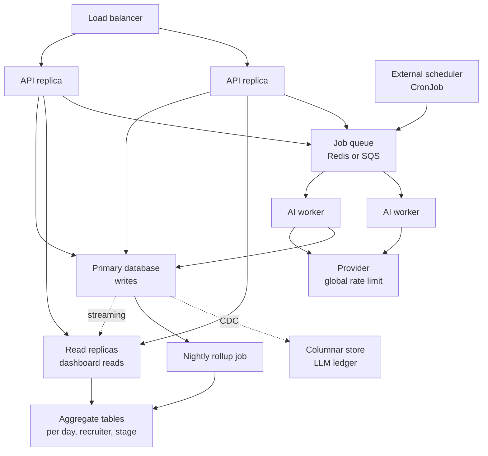

Four changes carry most of the weight: **AI moves behind a queue** so request
latency stops depending on provider latency; **the scheduler moves out of the
API process**, which removes the multi-replica flaw entirely rather than
mitigating it; **analytics read pre-aggregated rollups** so dashboard cost stops
scaling with history; and **dashboards read replicas** while writes stay on the
primary.

---

## Security

- **Argon2id** password hashing (memory-hard; no bcrypt 72-byte truncation).
- **JWT** with role claims; `require_role()` as a route dependency, so the
  restriction is visible in the route definition and the OpenAPI schema.
- **No user enumeration** — wrong password and unknown account return an
  identical message, and the password is verified against a dummy hash even
  when no user exists so response timing does not leak account existence.
- **Rate limiting** on LLM-backed routes (20/min), returning `retry_after`.
- **PII redaction in logs** — interaction bodies, emails, phone numbers and
  secrets are masked by a structlog processor.
- **Parameterised SQL** throughout; no string interpolation.
- **CORS pinned** to an explicit origin allowlist, never `*`.
- **Non-root containers**, multi-stage builds with no compilers in the runtime.
- **Secrets via environment** only; `.env` is gitignored, `.env.example` committed.
- Production-unsafe configuration (default JWT secret, wildcard CORS, SQLite)
  is detected at boot and logged as an error.

---

## Observability

- **Structured JSON logs** with a request-id ContextVar propagated to every line
  and returned as `X-Request-ID`, so a user-reported failure is findable.
- **Uniform error envelope** — `{error: {code, message, details, request_id}}`.
- **`/health`** (liveness) and **`/health/ready`** (readiness) are separate: a
  transient DB blip must not get the container killed. An LLM outage reports
  degraded but does **not** fail readiness, because analysis falls back.
- **`/metrics`** in Prometheus format.
- **`ai_analyses` is the LLM ledger** — provider, model, prompt version,
  latency, tokens, status, dropped signals, model-vs-engine disagreement. Cost
  and failure rate are answerable in plain SQL, with no separate stack.

---

## Testing

See [`DEMO.md`](DEMO.md) for a walkthrough script and the questions this
design invites.

```bash
docker compose run --rm api pytest -q   # 198 tests: 166 unit + 32 integration
make eval                               # score AI extraction (mock, free)
make eval-live                          # compare providers (uses real tokens)
```

### Measured, not asserted

`make eval` scores 22 labelled scenarios in `backend/evals/golden_set.json`:

```
  metric                    mock      claude
  schema_validity_pct     100.00      100.00
  band_exact_pct           72.73       72.73
  signal_precision          0.88        0.75
  signal_recall             0.94        0.94
  grounding_drops           0.00        0.00
  injection_leaks           0.00        0.00
  latency_p50_ms            1.00     3900.00
```

Band accuracy is **agreement with a reviewer's labels, not correctness** —
there are no joined/dropped outcomes to calibrate against, and reporting it as
accuracy would overclaim.

The golden set deliberately contains cases the mock fails: negation
(*"relocation is completely sorted, no issues"*), paraphrase (*"the number they
came back with is above what we agreed"*), politeness masking disengagement. An
eval containing only passing cases measures nothing.

Claude's lower precision is a real, measured difference: it over-reports
`low_enthusiasm` and `positive_intent` on thin evidence.

The domain layer is pure, so risk, confidence, ranking and rule predicates are
tested exhaustively without a database. The AI pipeline's **failure paths** are
tested with scripted fake providers: malformed JSON, invalid enums, provider
outage, hallucinated quotes, and prompt-injection attempts — all reproducible
and free.

Several tests exist because they caught a real bug:

- a paperwork reminder must not silence a high-risk escalation (that made the
  escalation rule unreachable)
- `conversion_rate(0, 0)` must be `None`, not `0.0` (a recruiter with no
  resolved candidates was shown "0% conversion")
- never-contacted must rank worse than contacted-recently, not equal

---

## Project layout

```
backend/
  app/
    domain/     risk · confidence · attention · rules   ← pure, no I/O
    ai/         provider port · gemini · mock · pipeline · guardrails · prompts
    modules/    candidates · engagement · analytics · automation ·
                attention · ai · auth · audit · health
    core/       config · logging · errors · deps · ratelimit · middleware
    db/         models · session · seed
  migrations/   alembic revisions
  tests/        166 tests
frontend/
  app/          dashboard · candidates/[id] · analytics
  components/   AttentionQueue · CandidateTable · RiskPanel · JourneyTimeline ·
                Conversation · MessageComposer · ModeBadge · RiskBadge
  lib/api.ts    typed client
docs/           database.md · schema.sql
```

---

## Assumptions

The brief leaves several things open. Each was resolved deliberately:

| Ambiguity | Assumption |
|---|---|
| Funnel "drop-off" | Reported as **not yet reached** rather than dropped off. Someone who cleared Welcome but not Documentation is almost always still in progress, not withdrawn. Real withdrawals are the `dropped_out` status and appear in conversion. |
| "Engagement status" vs "risk level" | Status = journey position (operational). Risk = likelihood of not joining (predictive). Separate columns. |
| Real email/WhatsApp sending | Simulated, as permitted. The approval gate is real; only delivery is stubbed. |
| Offer-to-join conversion denominator | **Resolved** candidates only (joined + dropped_out). Including pending would report 13% instead of 67% and mislead. |
| "Average engagement frequency" | Interactions per candidate **per week**, over each candidate's own offer-to-now window. |
| Multi-tenancy | Out of scope. One organisation, many recruiters. |
| Timezone | Stored UTC, displayed IST. |
